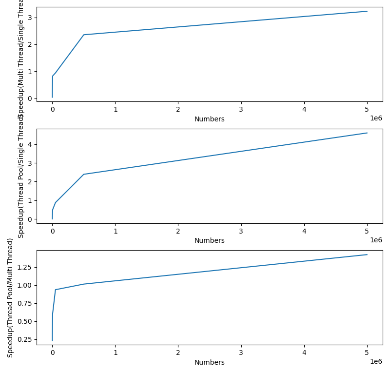
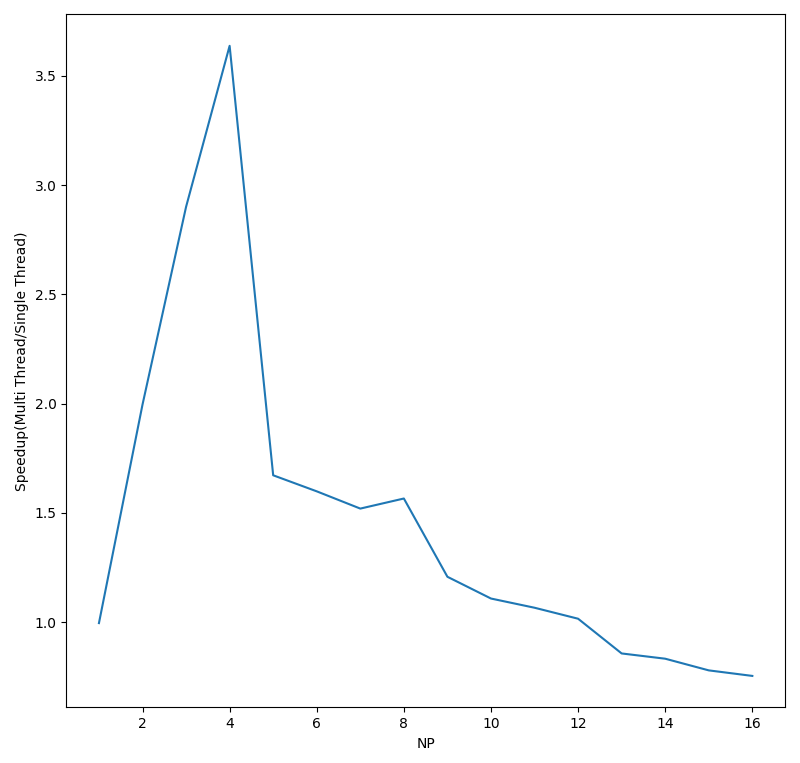
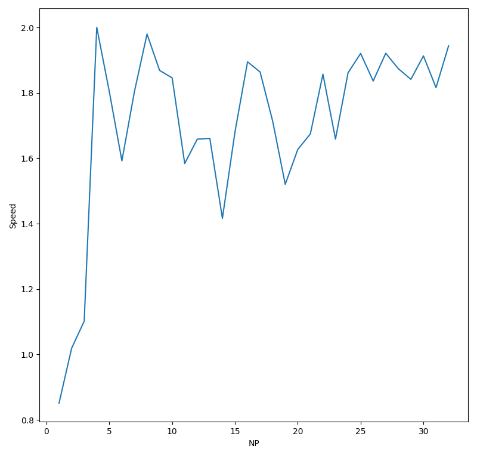

# Experiments of CSU Parallel Computing

> do not copy directly ^ ^

## Lab1 

Compare the speed rate of:
1. Multi thread and serially;
2. Thread pool and non-pool.

Here is the result simple:

## Lab2

Compare the speed rate of calculating pi using mpich and serially.

Here is the result simple:

## Lab3

Auto-find the best thread number of calculating big mat using openmpi.

Here is the result simple:

